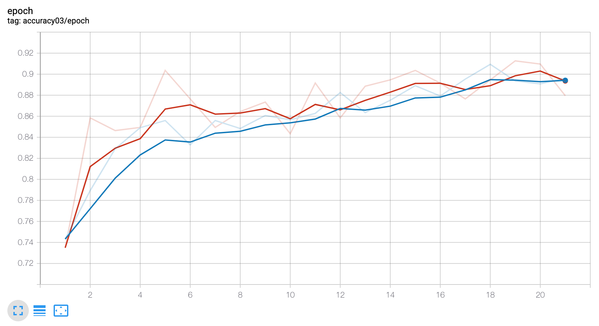
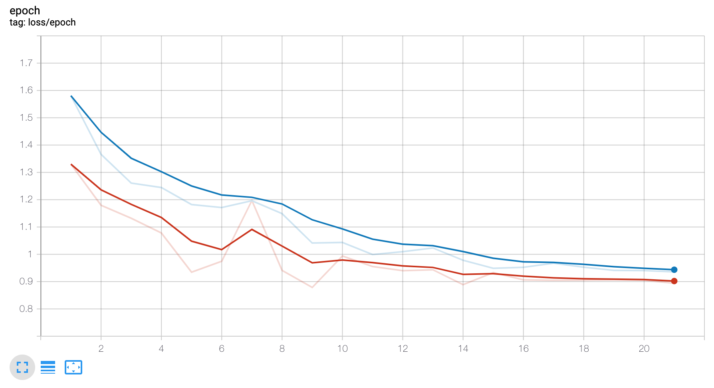

# aptos-blindness-pytorch
Kaggle's Aptos Blindness Detection challenge solution using pytorch. This repo is a work in progress. 

## Overview

There is a large set of retina images captured using fundus photography. Training dataset is labelled according to the severity of diabetic retinopathy in following categories.  

```
0 - No DR

1 - Mild

2 - Moderate

3 - Severe

4 - Proliferative DR
```

Goal is to predict this severity for a new image. 

## Requirements 
following needs to be installed befor running anything :
- torch
- torchvision 
- catalyst
- timm
- albumentations

## Run 

Modify config file in `config/config` to update parameters according to your needs

For training:
```shell
python train.py
```

Logs are stored under `./logs` folder with unique folder name. Tensorboard logs can be plotted as : 
```shell
tensorboard --logdir ${LOGDIR} --host 0.0.0.0
```

## Results

Training a `resnet50` backbone for classification results in :

### Accuracy 




### Loss 


